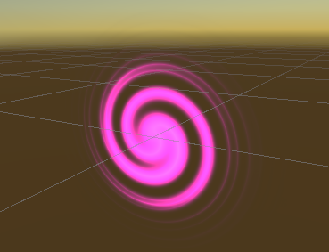
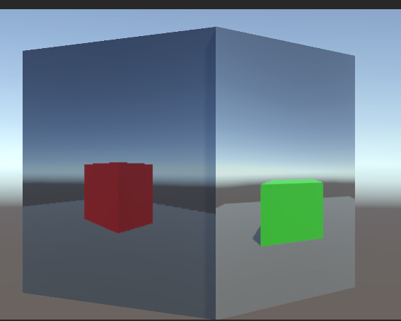
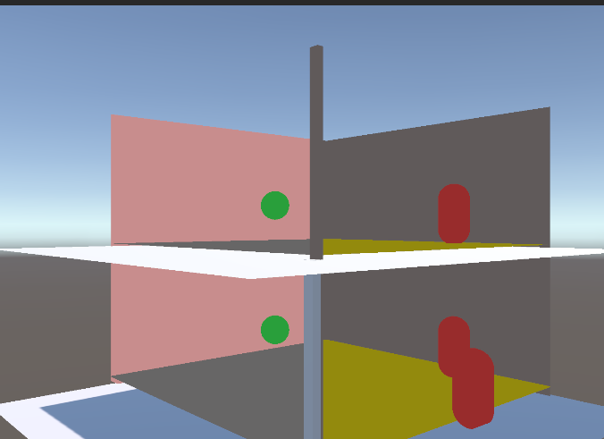

# graphic-tech

# Shadergraph  
使用 URP，主要参考
https://www.youtube.com/watch?v=w0znZIuvQ2I&list=PLpPd_BKEUoYjcFaqriaMchx5gOqBs2tDh&index=2

## shader-portal  
使用 Twirl 做扭曲，然后添加 Time 做旋转，叠加 Tex 做 Mask

## shader-forcefield  
https://www.youtube.com/watch?v=NiOGWZXBg4Y

## shader-outline  

## moncage  
模仿《笼中窥梦》的效果  

