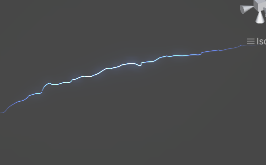
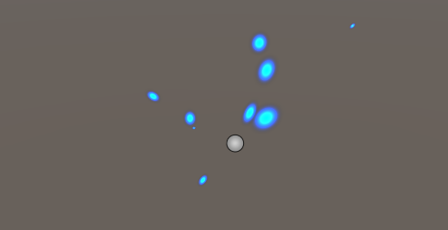

> 电弧特效

https://www.bilibili.com/video/BV1Ps4y1M7DC/?spm_id_from=333.999.0.0&vd_source=eb3eda58d7be185acf6d06b524d893d8
按照此视频，无法实现闪电颜色，怀疑是 shader 有问题（而且 shader 里面实现没看懂）

https://www.bilibili.com/video/BV1LT4y1z7h7/?spm_id_from=333.337.search-card.all.click&vd_source=eb3eda58d7be185acf6d06b524d893d8
这个视频不错，跟着很容易实现，另外还讲了火花溅射效果

> 电火花

实现细节就是在一个球形内随机发射，将 X 方向随机缩放压扁
